# Deploying PHP application on AWS EC2 instance.

## Introduction

This project shows how to deploy a PHP web application on an Amazon EC2 server using the LAMP stack (Linux, Apache, MariaDB, PHP). It explains the full process, including launching an EC2 instance, connecting to it with SSH, installing the required software, setting up the web server, and hosting a signup form application.

The setup includes:

Amazon EC2 instance (Amazon Linux)

Apache (httpd) as the web server

MariaDB as the database

PHP for backend processing

## Requirements

Before starting, ensure you have:

An AWS account with access to launch EC2 instances

A key pair (.pem file) to connect to your EC2 instance

Basic knowledge of Linux commands and SSH

Security group configured to allow:

     Port 22 (SSH) → for connecting to the server

     Port 80 (HTTP) → for accessing the web application

     Port 3306 (MySQL/MariaDB) → if connecting to the database remotely

Installed tools on your local machine:

    SSH client (e.g., Git Bash)

# Steps for Deployment

### Step 1: Launch EC2 instance and Establishing a secure connection to your EC2 instance

1. Launch instance

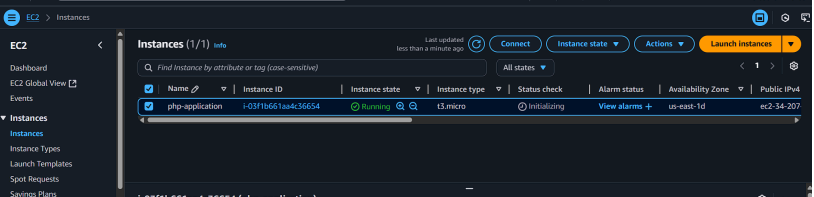

2. Copy the SSH command

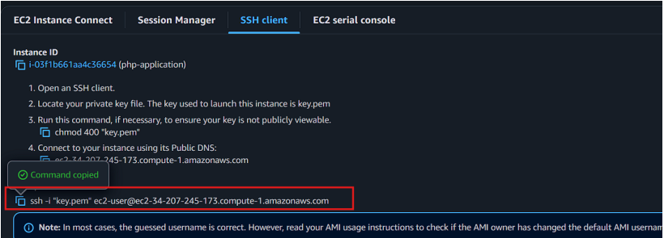

3. Paste command in Git bash 

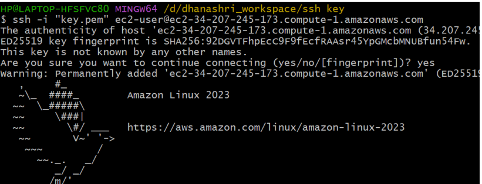

### Step 2: Automating LAMP Stack Setup on AWS EC2

1. Create a LAMP.sh file

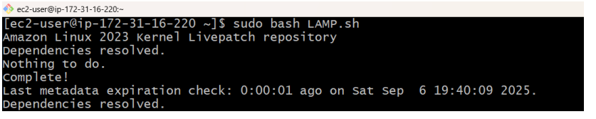

2. Insert the code for installing apache, mysql and php

       sudo yum update
       sudo yum install httpd mariadb105-server php -y
       sudo systemctl start httpd mariadb php-fpm
       sudo systemctl enable httpd mariadb php-fpm
       sudo echo"<h1> Welcome to my php Application </h1>">
       /var/www/html/index.html

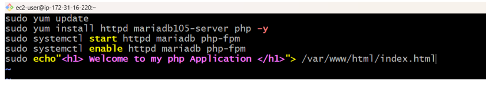

3. Check the status of apache, mysql and php 

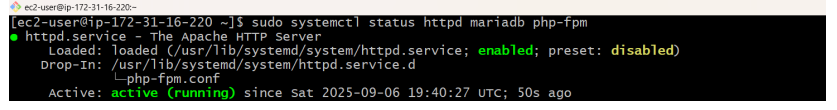

### Step 3: Change the Directory to Default Directory

    cd /var/www/html/

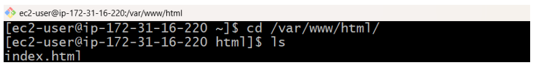

### Step 4: Building the Signup Page

1. Create a Signup.html file.

       sudo vim signup.html

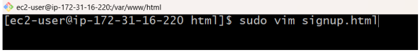

2. Code of Signup.html

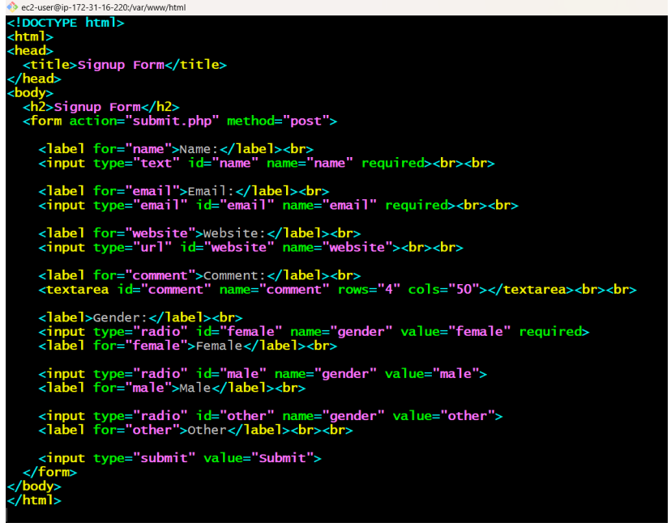

       

### Step 5: Configure the Database (MariaDB)

1. Generate the username and password.

       sudo mysql
       alter user root@localhost identified by 'root';

2. Login to Mysql (mariadb105-server)

       sudo mysql -u root -p

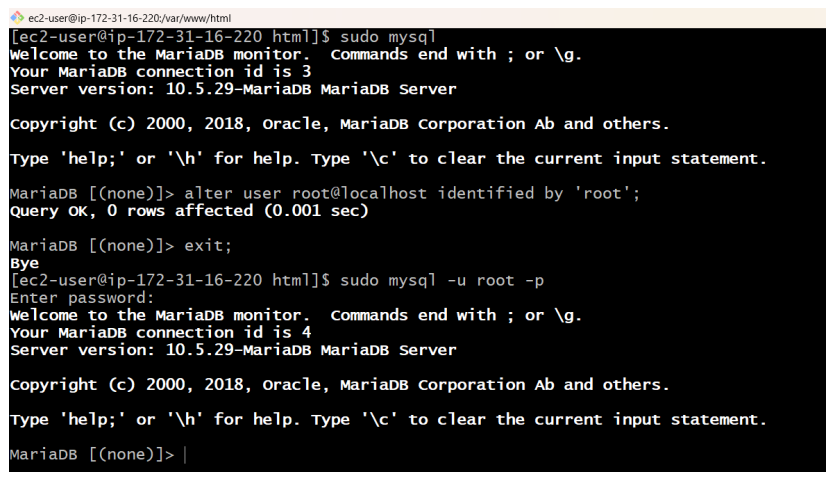

3. Create Database

       #create database
       create database FCT;
       #to see all databases
       show databases;
       #to use that database
       use FCT;

4. Create table accoring to the signup form.

       #create table
       CREATE TABLE users (
       id INT PRIMARY KEY AUTO_INCREMENT,
       name VARCHAR(50) NOT NULL,
       email VARCHAR(100) NOT NULL UNIQUE,
       website VARCHAR(255),
       gender ENUM('male', 'female', 'other') NOT NULL,
       comment TEXT
       );

5. Describe the table

        desc users;

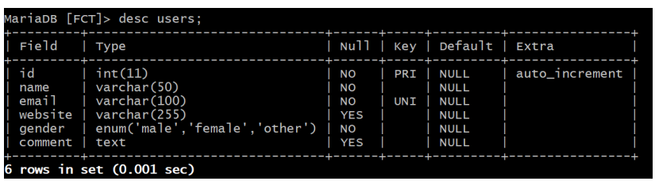

### Step 6: Connect Form to Database with submit.php

1. Create the file submit.php

        sudo vim submit.php

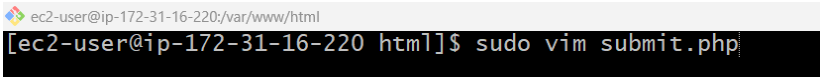

2. Code of submit.php 

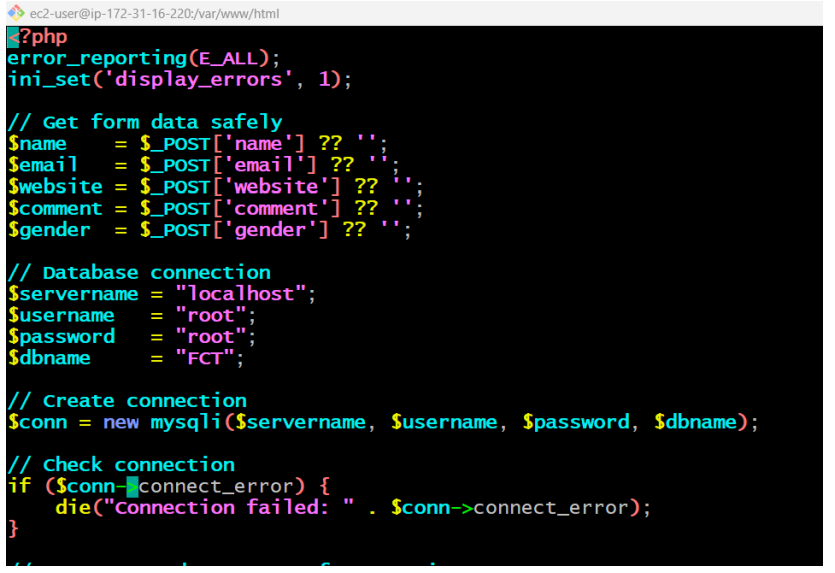

### Step 7: Install PHP-MySQL Connector

     sudo yum install php8.4-mysqlnd.x86_64

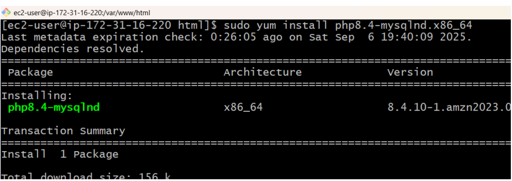

### Step 8: Restart the services

     sudo systemctl restart httpd mariadb php-fpm

### Step 9: Deploy and Test the Signup Form

1. Copy the public IP and Paste the public IP in any browser 

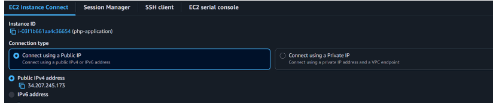

2. Signup.html

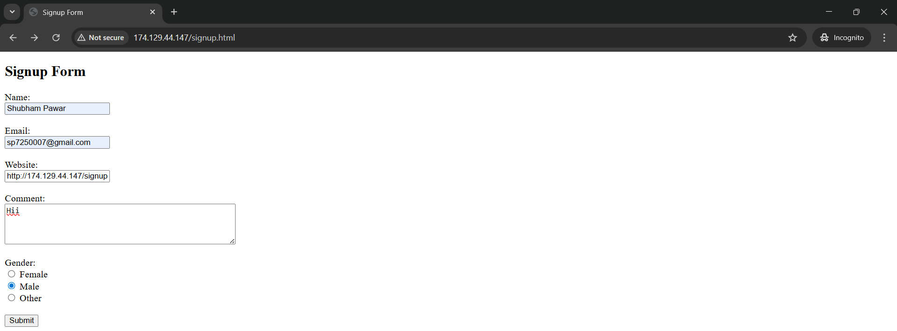

3. Submit.php

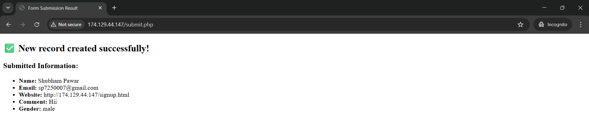

# Summary

In this project, we deployed a PHP-based signup form on an AWS EC2 instance using the LAMP stack (Linux, Apache, MariaDB, PHP). We launched and set up an EC2 instance with Amazon Linux, then used a custom lamp.sh script to install the LAMP stack automatically. After that, we built a signup.html form and connected it to a MariaDB database with submit.php, which saved user input into the database. To enable communication between PHP and MariaDB, we added the PHP-MySQL connector. Finally, we tested the form in a browser and confirmed that the data was stored successfully.
